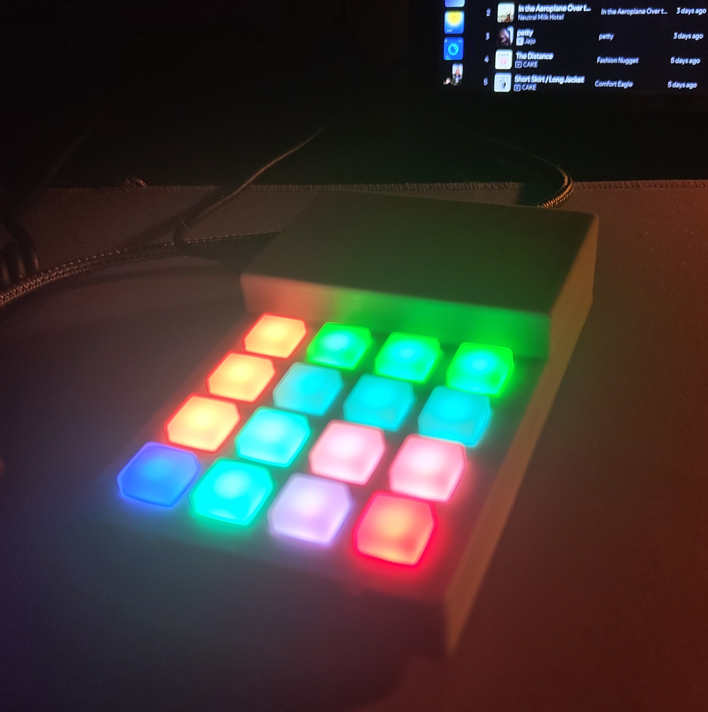
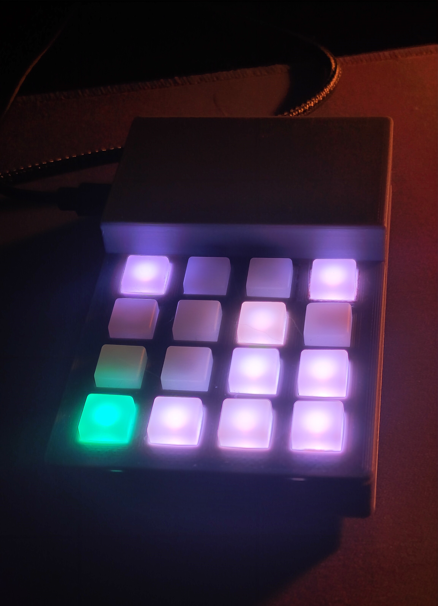
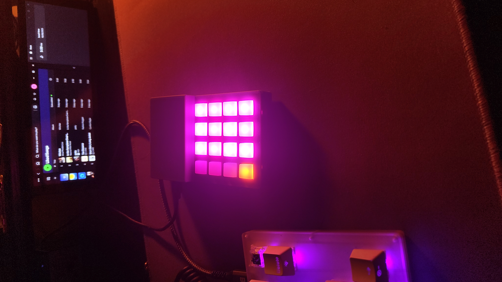

# PIM551_Macro_Keyboard
Parts list:
- Pimoroni Pico RGB Keypad Base (https://core-electronics.com.au/pimoroni-pico-rgb-keypad-base.html)
- Raspberry Pi Pico H (https://core-electronics.com.au/raspberry-pi-pico-h-with-headers.html)
- Any Micro USB to USB A cable

Setup instructions:
1. Install CircuitPython on the Pico (https://learn.adafruit.com/getting-started-with-raspberry-pi-pico-circuitpython/circuitpython)
2. Replace code.py on the Pico (CIRCUITPY drive) with the version in this repository
3. Profit!

Examples:
- This macropad comes loaded with 12 different presets for different applications suited to my use. Feel free to customise this to better suit your usage!

Full preset containing email macro shortcuts, spotify controls, advanced copy paste options and more

Generic shortcut preset

Number pad addition for under 100% keyboards

